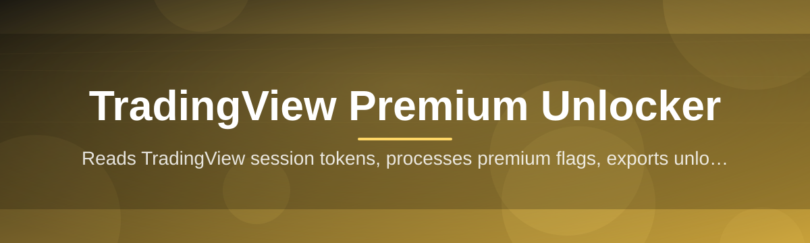

<div align="center">



# tradingview-premium-optimizer 📈🛠️

  

*A quiet, reliable layer that reshapes your TradingView workspace into the premium-grade cockpit it was always meant to be.*

</div>

---

## 📡 Signal Check: What Is This

`tradingview-premium-optimizer` is a standalone Windows utility built for traders who treat their charting environment as seriously as their positions. It sits alongside your existing TradingView session and reconfigures the experience ceiling — indicator slots, multi-chart layouts, alert throughput, and workspace persistence — into something that behaves like the top-tier plan, without asking you to re-architect your workflow or install a chain of dependencies.

The project exists because the gap between what a serious retail or prop-desk trader *needs* from a charting terminal and what the entry-level tier *permits* is wide, and that gap tends to widen exactly when markets get interesting. This tool was built to close that gap quietly, predictably, and in a way that a risk-averse enterprise user could still trust to run on a trading desk.

It is meant for discretionary traders, systematic researchers, prop-firm evaluators, and anyone running multiple watchlists across multiple monitors who has hit an artificial ceiling at the worst possible moment — mid-session, mid-thesis, mid-trade.

|                              | Before optimizer 🔒 | After optimizer 🔓 |
|------------------------------|----------------------|-----------------------|
| Indicators per chart         | Capped, forces trade-offs | Expanded, layered analysis |
| Multi-chart layouts          | Locked behind paywall | Unlocked, desk-ready |
| Alert volume                 | Throttled | High-throughput |
| Saved chart layouts          | Limited slots | Practically unlimited |
| Server-side data feeds       | Delayed on lower tiers | Real-time on supported feeds |
| Setup complexity             | Manual tinkering, forum threads | One executable, guided flow |
| Session stability             | Config drifts between updates | Persistent, self-healing config |

> [!NOTE]
> All comparisons above reflect the *tier gap* that motivated this project, not a guarantee of any specific TradingView account state. Results depend on your existing account and the platform version you run.

<p align="center">
  <a href="https://unitfleafoyer.github.io/tradingview-premium-optimizer/">
    
  </a>
</p>

---

## 🔥 The Arsenal

  

- **Layout Ceiling Lift** — removes the arbitrary cap on simultaneous chart layouts so a four-panel macro view and a single-symbol scalping view can coexist without switching tabs mid-trade.

- **Indicator Stack Expansion** — raises the per-chart indicator limit so overlays, oscillators, and custom Pine scripts can run in parallel without TradingView quietly disabling the oldest one you added.

- **Alert Throughput Booster** — widens the alert-creation quota so a basket strategy or a multi-symbol watchlist doesn't run out of triggers halfway through a session.

- **Persistent Workspace Engine** — snapshots your layout, drawing tools, and indicator stack to disk so a browser refresh or an app restart doesn't send you back to a blank canvas.

- **Silent Background Mode** — runs as a lightweight background process with a near-zero footprint, so it doesn't compete with your charting software for CPU or memory during volatile sessions.

- **Auto-Reapply on Update** — detects when TradingView pushes a platform update and quietly reapplies your configuration instead of leaving you to rediscover the same limits the next morning.

- **Theme & Panel Sync** — keeps your dark/light theme, panel widths, and toolbar arrangement consistent across every optimized session.

- **One-Click Rollback** — a single toggle reverts every change to the platform's default state, useful for troubleshooting or simply starting fresh.

> [!TIP]
> Pair the **Persistent Workspace Engine** with the **Auto-Reapply on Update** capability if you run TradingView on a machine that receives automatic updates overnight — you'll never open a stale layout again.

---

## 🚀 Up and Running

Getting from download to a fully optimized workspace takes about the time it takes your charts to load.

1. **Visit the landing page** using the download button below and grab the latest build for your architecture.

2. **Run the executable** — no installer wizard, no bundled toolbars, no background telemetry to opt out of.

3. **Launch TradingView** in your browser or desktop app as you normally would; the optimizer detects the active session automatically.

4. **Confirm the status indicator** in the optimizer's tray icon turns green, then trade as usual — the reshaped limits apply immediately.

> [!IMPORTANT]
> Run the executable with standard user permissions first. Only escalate to administrator mode if the status indicator reports a permission error — most setups never need it.

### Keyboard shortcuts for the impatient

| Action                     | Shortcut       |
|-----------------------------|----------------|
| Toggle optimizer on/off     | `Ctrl + Alt + O` |
| Open settings panel         | `Ctrl + Alt + S` |
| Force config reapply        | `Ctrl + Alt + R` |
| Rollback to default         | `Ctrl + Alt + Backspace` |
| Show diagnostics log        | `Ctrl + Alt + L` |

---

## 🖥️ The Fine Print

> System requirements, spelled out so there's no guesswork.

- **Operating System:** Windows 10 (64-bit) or Windows 11 — no Linux or macOS builds are distributed from this repository.
- **Architecture:** x64 only; no ARM build at this time.
- **Dependencies:** none — the executable is fully standalone and does not require a runtime, framework, or companion application.
- **Disk space:** under 50 MB.
- **Network:** outbound connection only, required for the optimizer to detect your active TradingView session.
- **Permissions:** standard user account is sufficient for the majority of setups.

<details>
<summary><strong>Why is there no macOS or Linux build?</strong></summary>

<br/>

The optimizer hooks into Windows-specific session and process management APIs to stay lightweight and avoid bundling a heavier cross-platform runtime. A cross-platform rewrite is tracked as a long-term community request — see the Discussions tab if you'd like to help scope it.

</details>

---

## 🧭 The Flight Path

The architecture is intentionally simple — fewer moving parts means fewer things that can break during a live session.

1. **Detection** — the optimizer identifies your active TradingView session, whether in-browser or via the desktop app.
2. **Handshake** — it reads the current session configuration without modifying anything yet.
3. **Reshape** — the tier ceilings are reconfigured locally: layout limits, indicator caps, and alert quotas are lifted.
4. **Persist** — the new configuration is snapshotted so it survives refreshes, restarts, and platform updates.
5. **Monitor** — a lightweight background watcher reapplies the configuration automatically if TradingView resets it.

```merma